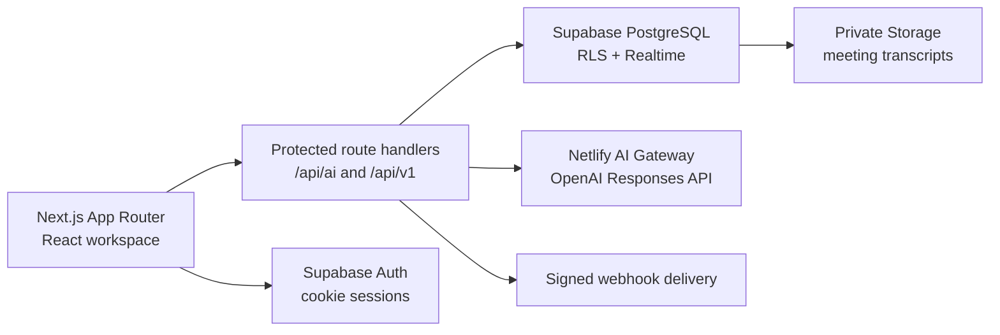

# Dynamis Signal

**An AI-native CRM that turns customer activity into clear revenue decisions.**

[Live demo](https://dynamis-signal.netlify.app) · [Explore the CRM](https://dynamis-signal.netlify.app/workspace) · [Report an issue](https://github.com/eemirex/dynamis-signal/issues)


## Overview

Dynamis Signal is a portfolio-grade B2B CRM concept built around a simple question: **what should the revenue team do next?**

Most CRMs store facts but leave people to reconstruct the relationship. Signal brings customer records, opportunity movement, email engagement, meeting outcomes, and team activity into one workspace. Its AI layer uses that owned context to draft follow-ups, summarize meetings, and surface risks without inventing facts.

The public deployment is an interactive, credential-free product demo. The repository also contains the production foundation for Supabase authentication, multi-tenant PostgreSQL data, protected AI routes, REST endpoints, private transcript storage, realtime updates, and signed webhooks.

> The names, people, companies, opportunities, and performance figures in the demo are fictional. They exist to demonstrate the product experience.

## Product tour

The demo includes complete, responsive views for:

- **Revenue dashboard** — pipeline value, weighted forecast, win rate, momentum, priorities, stage health, and live activity.
- **Customer database** — searchable customer records with lifecycle state, ownership, relationship context, and contact detail drawers.
- **Lead pipeline** — a draggable five-stage Kanban board with deal value, probability, health, owners, next steps, and opportunity details.
- **Email tracking** — an inbox-like workspace showing delivery, opens, replies, relationship context, and a contextual reply flow.
- **AI email writer** — produces a focused draft from the recipient, desired outcome, tone, deal context, and recent activity.
- **AI meeting summaries** — extracts an executive summary, decisions, action items, risks, ownership, and sentiment.
- **Reporting** — pipeline conversion, source mix, forecast performance, and individual team results.
- **User management** — member visibility, role assignments, status, and invitation controls.
- **Global search** — quickly locates contacts, companies, opportunities, and recent activity.
- **Webhooks** — endpoint controls, subscribed events, signing information, test events, and delivery history.

Nearly every primary control in the workspace is interactive: switch views, open customer and deal drawers, generate an email, review meeting intelligence, search the CRM, add a lead, toggle endpoints, and send a webhook test event.

## Architecture



### Frontend

- Next.js 16 App Router and React 19
- Strict TypeScript
- Purpose-built CSS design system; no template UI kit
- Lucide iconography
- Responsive layouts for desktop, tablet, and mobile
- Static public demo with no exposed secrets

### Backend foundation

- Supabase Auth with cookie-based SSR helpers
- PostgreSQL schema and migrations
- Row-level security on every tenant-owned table
- Realtime publications for deals and activities
- Private object storage for meeting transcripts
- OpenAI Responses API through Netlify AI Gateway
- HMAC-SHA256 webhook signing helpers
- Versioned `/api/v1` REST surface

## Data model

The initial migration models the CRM as an organization-scoped system:

| Domain | Core tables |
| --- | --- |
| Identity | `profiles`, `organizations`, `organization_members` |
| Customers | `companies`, `contacts` |
| Revenue | `pipelines`, `pipeline_stages`, `deals`, `deal_contacts` |
| Engagement | `activities`, `email_messages`, `email_events` |
| Meetings | `meetings`, `meeting_attendees`, `meeting_summaries` |
| Intelligence | `ai_generations` |
| Integrations | `webhook_endpoints`, `webhook_deliveries` |
| Governance | `audit_log` |

Membership checks live in a private database schema and are called by row-level security policies. Operational queries are indexed by `organization_id` and their common sort or filter fields. Soft deletion is used for customer and deal records.

## Security model

- Every operational table has row-level security enabled.
- Organization membership is enforced in PostgreSQL, not only in application code.
- Owners and admins manage organization settings, membership, and webhook endpoints.
- Manager-level roles can perform destructive operational actions.
- Supabase service-role credentials are never used in browser code.
- Server authentication uses verified claims instead of trusting client state.
- AI routes require an authenticated session outside demo mode.
- AI prompts explicitly treat CRM content and transcripts as untrusted data.
- Meeting transcripts are stored in a private bucket under an organization path.
- Webhook endpoints require HTTPS; secret hashes are stored instead of plaintext secrets.
- Outgoing webhook signatures use HMAC-SHA256 and timing-safe verification.
- The `.env*` files and build outputs are excluded from source control.

See [SECURITY.md](./SECURITY.md) for reporting and operational guidance.

## API

The production foundation exposes these server routes:

| Method | Route | Purpose |
| --- | --- | --- |
| `POST` | `/api/ai/write-email` | Generate a context-grounded B2B email |
| `POST` | `/api/ai/summarize-meeting` | Convert a transcript into structured meeting intelligence |
| `GET` | `/api/v1/contacts` | Search and paginate organization contacts |
| `POST` | `/api/v1/contacts` | Create an organization contact |
| `GET` | `/auth/callback` | Complete a Supabase PKCE authentication flow |

Example email request:

```bash
curl --request POST http://localhost:3000/api/ai/write-email \
  --header "Content-Type: application/json" \
  --cookie "your-auth-session-cookie" \
  --data '{
    "recipient": "Amara at Kora Labs",
    "goal": "Restart the security review and agree on a date",
    "tone": "warm and direct",
    "context": "No reply for eight days. The buyer previously agreed that security approval is the final blocker."
  }'
```

Server responses do not expose provider credentials. Inputs are trimmed, length-bounded, and validated before model calls.

## Run locally

### Prerequisites

- Node.js 22 or newer
- pnpm 10.12 or newer
- A Supabase project for connected mode
- An OpenAI-compatible key when not running through Netlify AI Gateway

### Installation

```bash
git clone https://github.com/eemirex/dynamis-signal.git
cd dynamis-signal
pnpm install
cp .env.example .env.local
pnpm dev
```

Open [http://localhost:3000](http://localhost:3000). The default `.env.example` enables demo mode, so the product tour works before any external service is connected.

### Environment variables

| Variable | Required | Description |
| --- | --- | --- |
| `NEXT_PUBLIC_SUPABASE_URL` | Connected mode | Supabase project URL |
| `NEXT_PUBLIC_SUPABASE_PUBLISHABLE_KEY` | Connected mode | Browser-safe publishable key |
| `NEXT_PUBLIC_DEMO_MODE` | No | `true` keeps the portfolio experience credential-free |
| `NEXT_PUBLIC_APP_URL` | Recommended | Canonical application URL |
| `OPENAI_API_KEY` | Local AI only | Injected automatically by Netlify AI Gateway in production |
| `OPENAI_BASE_URL` | No | OpenAI-compatible endpoint; injected by the gateway |
| `WEBHOOK_SIGNING_SECRET` | Webhooks | Secret used to sign outgoing deliveries |

Never commit `.env.local`, service-role keys, database passwords, or webhook signing secrets.

## Connect Supabase

1. Create a Supabase project.
2. Install the Supabase CLI and authenticate.
3. Link this repository:

   ```bash
   supabase link --project-ref YOUR_PROJECT_REF
   ```

4. Apply the schema:

   ```bash
   supabase db push
   ```

5. Add the project URL and publishable key to `.env.local`.
6. Set `NEXT_PUBLIC_DEMO_MODE=false`.
7. Configure the site URL and `/auth/callback` redirect URL in Supabase Auth.

The migration is in [`supabase/migrations/202607280001_initial_crm.sql`](./supabase/migrations/202607280001_initial_crm.sql). The optional local seed explains how to attach the demo organization to a real test user.

## Docker

The included container builds and runs the full Next.js application:

```bash
docker compose up --build
```

The app is available at [http://localhost:3000](http://localhost:3000). Supply production environment variables through your deployment platform rather than baking them into the image.

## Quality checks

```bash
pnpm typecheck
pnpm lint
pnpm build
```

The GitHub Actions workflow runs all three checks on pushes to `main` and on pull requests. Dependabot monitors npm and Actions dependencies.

## Deployment

### Netlify portfolio demo

`netlify.toml` creates a static export of the public landing page and interactive demo. The build temporarily excludes server-only route handlers, restores them after export, and never deletes source files.

```bash
netlify deploy --build
netlify deploy --build --prod
```

### Connected production application

For a fully connected CRM, deploy the normal Next.js build with server route support, add the Supabase variables, and enable Netlify AI Gateway. After the first production deploy, the gateway injects the provider key and compatible base URL into server functions.

The connected Supabase project is intentionally not provisioned by this repository because creating one requires selecting an account, region, and billing plan.

## Design decisions

- **Dynamis branding:** dark graphite, warm white, and signal green communicate focus and momentum without imitating established CRM products.
- **Operational home screen:** the dashboard prioritizes recommended actions over vanity analytics.
- **Grounded AI:** model routes receive explicit CRM context and are instructed never to manufacture commitments.
- **Demo/production split:** visitors can experience the product instantly while the repository demonstrates a credible server architecture.
- **Defense in depth:** route authentication and validation complement database RLS rather than replacing it.
- **No generated-template residue:** product language, data, states, component structure, and visual system are authored specifically for Signal.

## Roadmap

- OAuth connections for Gmail and Outlook
- Calendar ingestion and meeting recording providers
- Background webhook delivery workers and exponential retries
- Custom fields and import mapping
- Saved reporting segments
- Workspace notifications and user preferences
- End-to-end tests for authenticated flows

## Contributing

Issues and focused pull requests are welcome. Read [CONTRIBUTING.md](./CONTRIBUTING.md) before proposing changes.

## License

Released under the [MIT License](./LICENSE).

---

Built by [Emmanuel Emirex](https://github.com/eemirex) as part of the Dynamis product portfolio.
